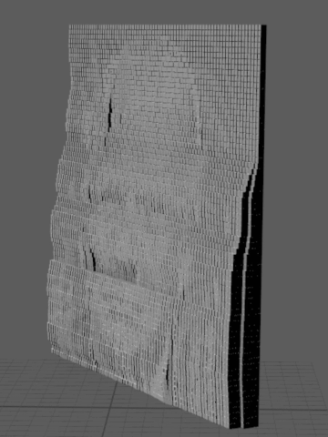

# ShadowPix

Implementation of **[SHADOWPIX: Multiple Images from Self Shadowing](https://www.cs.tau.ac.il/~amberman/shadowpixPaper.pdf)** paper.

Input (image)            |  Output (mesh)
:-------------------------:|:-------------------------:
  |  

## Visualizer 
To use **ShadowPix** visualization -
```js
~/DIR/ShadowPix
<b> >>> cd visualizer </b>

~/DIR/ShadowPix/visualizer
>>> npm install
...

>>> npm start
...

Compiled successfully!

You can now view ShadowPix-Visualizer in the browser.

Local:            http://localhost:3000/

``` 
